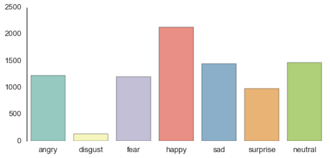
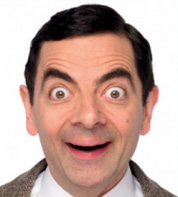
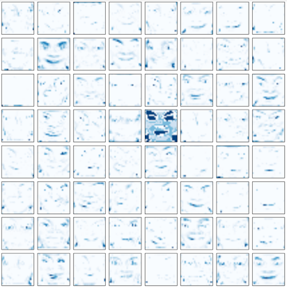
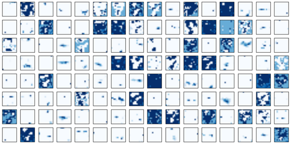
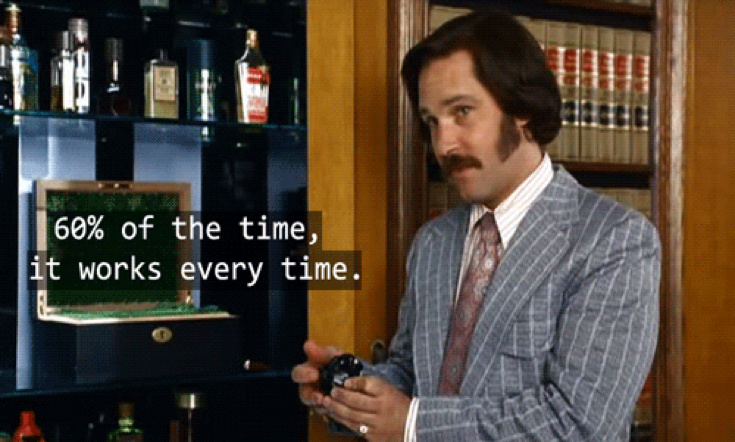
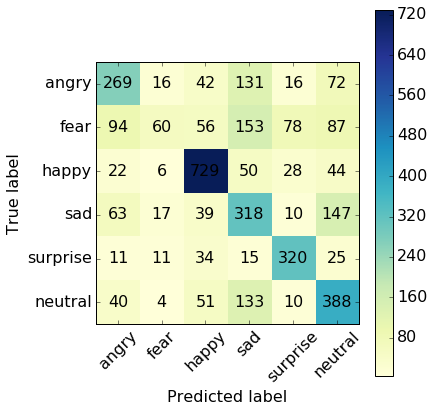
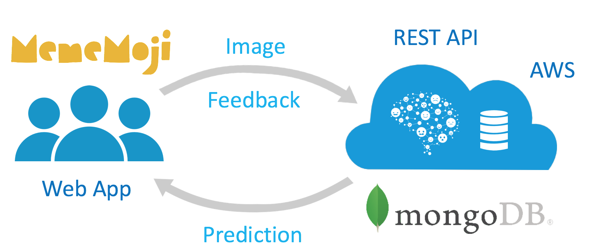

*A facial emotion recognition system built with deep convolutional nets*

##Motivation
------------------------------
Most of us would agree that human facial expressions can be classified into roughly 7 basic emotions: happy, sad, surprise, fear, anger, disgust, and neutral. Our facial emotions are expressed through activation of specific sets of facial muscles. These sometimes subtle, yet complex, signals in an expression often contain an abundant amount of information about the state of mind. Human beings are well-trained in reading the emotions of others, in fact, at just 14 months old, babies can already tell the difference between happy and sad. **But can computers do a better job than humans in accessing emotional states?** 

> **“2016 is the year when machines learn to grasp human emotions”**
--Andrew Moore, the dean of computer science at Carnegie Mellon. 

To answer the question, I designed a deep learning neural network that gives machines the ability to make inferences about our emotional states. In other words, I give them eyes to see what we see. It’s about time we build some highly emotional machines. 

##The Database
------------------------------
The dataset I used for training the model is from a Kaggle Facial Expression Recognition Challenge a few years back (FER2013). It comprises a total of 35887 pre-cropped, 48-by-48-pixel grayscale images of faces each labeled with one of the 7 emotion classes: anger, disgust, fear, happiness, sadness, surprise, and neutral. 

#####Figure 1. An overview of FER2013.

As I was exploring the dataset, I discovered an imbalance of the “disgust” class (only 113 samples) compared to many samples of other classes. I decided to merge disgust into anger given that they both represent similar sentiment. To prevent testing set leakage, I built a data generator `fer2013datagen.py` that can easily separate training and hold-out set to different files. I used 28709 labeled faces as the training set and held out the rest (3589+3589) for after-training validation. The resulting is a 6-class, balanced dataset, shown in Figure x, that contains angry, fear, happy, sad, surprise, and neutral. Now we’re ready to train.

#####Figure 2. Training and validation data distribution.

##The Model
------------------------------

#####Figure 3. Mr. Bean, the model for the model.

Deep learning is a popular technique used in computer vision. I chose convolutional neural network (CNN) layers as building blocks in creating my model architecture. CNNs are known to imitate how the human brain works on the back end when analyzing visuals. I will use a picture of Mr. Bean as an example to explain how images are fed into the model, because who doesn’t love Mr. Bean? 

A typical architecture of a convolutional neural network has an input layer, convolutional layers, dense layers (aka. fully-connected layers), and an output layer.  These are linearly stacked layers ordered in sequence. In Keras, this it is called `Sequential()` in which the layers would be built.

###Input Layer
* This layer has pre-determined, fixed dimensions, so the image must be pre-processed before it can be fed into the layer. I used OpenCV, a computer vision library, for face detection in the image. The `haar-cascade_frontalface_default.xml` in OpenCV contains pre-trained filters and uses `Adaboost` to quickly find and crop the face. 
* The cropped face is then converted into grayscale with `cv2.cvtColor` and resized to 48-by-48 pixels with `cv2.resize`. This step greatly reduces the dimensions compared to the original RGB format with three color dimensions (3, 48, 48).  The pipeline ensures every image can be fed into the input layer as a (1, 48, 48) numpy array.

###Convolutional Layers
* The numpy array gets passed into the `Convolution2D` layer where I specify the number of filters as one of the hyperparameters. The **set of filters** (aka. kernel) are non-repetitive with randomly generated weights. Each filter, (3, 3) receptive field, slides across the original image with shared weights to create a new feature map. 
*  The convolution step generates **feature maps** that represent the unique ways pixel values are enhanced, for example, edge and pattern detection. In Figure xx, a feature map is created by applying filter 1 across the entire image. Other filters are applied one after another creating a set of feature maps. 

#####Figure 4. Convolution and 1st max-pooling used in the network.

* **Pooling** is a dimension reduction technique usually applied after one or several convolutional layers. It is an important step when building CNNs as adding more convolutional layers can greatly affect computation time. I used a popular method called `MaxPooling2D` that uses (2, 2) windows each time only to keep the maximum pixel value. As seen in Figure 4, max-pooling on the (2, 2) square sections across the feature map results in a dimension reduction by 4.
* As you might have guessed, the feature maps become increasingly abstract down the pipeline the more pooling layers added. Figure 5 and 6 gives an idea of what the machine sees in feature maps after 2nd and 3rd max-pooling. 

#####Figure 5. CNN (64-filter) feature maps after 2nd layer of max-pooling.

#####Figure 6. CNN (128-filter) feature maps after 3nd layer of max-pooling.

###Dense Layers

to be continued ...

###Output Layer

to be continued ...

##Model Evaluation
----------------------------

examples of predictions

#####Figure 6. Temple of the many-face god.

##The API & Webapp
----------------------------

[MemeMoji --the app](http://54.227.229.33:5000/static/FaceX/index.html) Try it!

##What's next?
----------------------------

##References
----------------------------

